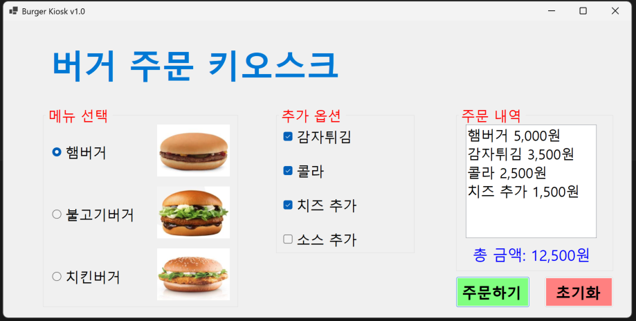
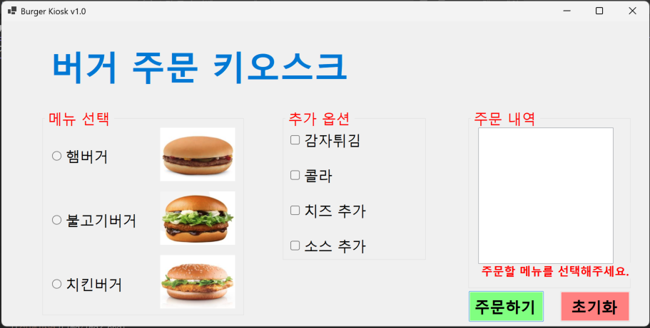
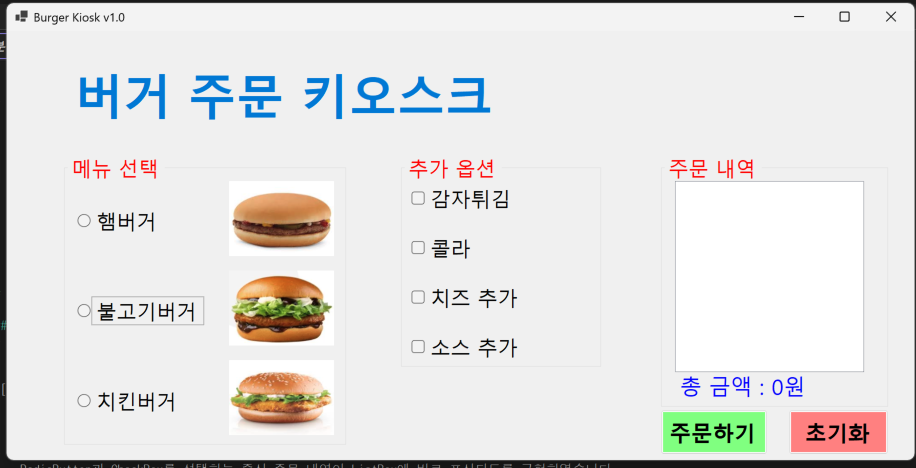
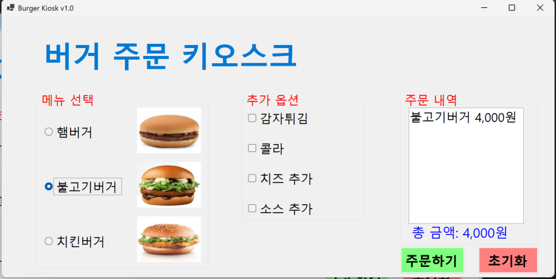

# (C# 코딩) 버거 주문 키오스크

## 개요
- C# 프로그래밍 학습
  - 1줄 소개: 버거와 추가 옵션을 선택하여 주문 내역과 총 금액을 확인할 수 있는 키오스크 프로그램
- 사용한 플랫폼:
  - C#, .NET Windows Forms, Visual Studio, GitHub
- 사용한 컨트롤:
  - Label, GroupBox, RadioButton, CheckBox, PictureBox, ListBox, Button
- 사용한 기술과 구현한 기능:
  -  Visual Studio를 이용하여 Windows Forms 화면을 구성하였습니다.
  - GroupBox를 이용하여 메뉴 선택, 추가 옵션, 주문 내역 영역을 구분하였습니다.
  - RadioButton을 이용하여 햄버거, 불고기버거, 치킨버거 중 하나를 선택할 수 있도록 구현하였습니다.
  - CheckBox를 이용하여 감자튀김, 콜라, 치즈 추가, 소스 추가를 여러 개 선택할 수 있도록 구현하였습니다.
  - Checked 속성을 사용하여 선택된 메뉴와 옵션을 확인하였습니다.
  - int 형 변수 totalCost를 사용하여 선택한 항목의 가격을 누적 계산하였습니다.
  - ListBox를 사용하여 선택한 메뉴와 옵션의 주문 내역을 화면에 출력하였습니다.
  - Label을 사용하여 총 금액을 화면에 출력하였습니다.
  - 주문하기 버튼을 클릭하면 선택한 항목의 주문 내역과 총 금액이 표시되도록 구현하였습니다.
  - 초기화 버튼을 클릭하면 선택한 항목이 모두 해제되고 주문 내역과 총 금액이 초기화되도록 구현하였습니다.
  - 메뉴를 선택하지 않고 주문하기 버튼을 클릭했을 때 에러 메시지가 Label에 표시되도록 구현하였습니다.
  - Tab 키, 방향키, Space 키, Enter 키를 이용하여 키보드만으로 주문이 가능하도록 구현하였습니다.
  - RadioButton과 CheckBox를 선택하는 즉시 주문 내역과 총 금액이 바로 갱신되도록 구현하였습니다.

 ## 과제1

 ## 실행 화면

- 구현한 내용 (위 그림 참조)
  

- 코드의 실행 스크린샷과 구현 내용 설명
  - 버거 주문 키오스크의 기본 화면을 구성하였습니다.
  - GroupBox를 이용하여 메뉴 선택, 추가 옵션, 주문 내역 영역을 구분하였습니다.
  - RadioButton으로 햄버거, 불고기버거, 치킨버거 중 하나를 선택할 수 있도록 구현하였습니다.
  - CheckBox로 감자튀김, 콜라, 치즈 추가, 소스 추가를 여러 개 선택할 수 있도록 구현하였습니다.
  - 주문하기 버튼을 누르면 선택한 메뉴와 옵션이 ListBox에 표시되고 총 금액이 Label에 출력되도록 구현하였습니다.
  - 초기화 버튼을 누르면 선택한 항목이 모두 해제되고 주문 내역과 총 금액이 초기화되도록 구현하였습니다.

# 과제2

## 실행 화면

- 코드의 실행 스크린샷과 구현 내용 설명

  

- 구현한 내용 (위 그림 참조)
  - 메뉴를 선택하지 않고 주문하기 버튼을 눌렀을 때 에러 메시지가 표시되도록 구현하였습니다.
  - MessageBox 대신 주문하기 버튼 근처의 Label에 안내 문구가 출력되도록 수정하였습니다.

  

# 과제3

## 실행 화면
- 코드의 실행 스크린샷과 구현 내용 설명

- 스크린샷 설명
  - 키보드를 이용해 각 항목을 포인트 하는 모습입니다. 아직 스페이스를 누르지 않았기에 선택은 되지 않은 모습입니다.

- 구현한 내용 (위 그림 참조)
  - 마우스를 사용하지 않고 키보드만으로 주문이 가능하도록 구현하였습니다.
  - Tab 키를 이용하여 GroupBox 사이를 이동할 수 있도록 구성하였습니다.
  - 방향키를 이용하여 RadioButton 항목 사이를 이동할 수 있도록 하였습니다.
  - Space 키를 이용하여 메뉴와 옵션을 선택할 수 있도록 하였습니다.
  - Enter 키를 이용하여 주문하기 버튼과 초기화 버튼을 실행할 수 있도록 구현하였습니다.

  

# 과제4

## 실행 화면
- 코드의 실행 스크린샷과 구현 내용 설명

- 구현한 내용 (위 그림 참조)
  - RadioButton과 CheckBox를 선택하는 즉시 주문 내역이 ListBox에 바로 표시되도록 구현하였습니다.
  - 선택한 항목의 가격이 즉시 계산되어 총 금액이 Label에 바로 반영되도록 구현하였습니다.
  - 항목을 해제하면 주문 내역과 총 금액도 즉시 갱신되도록 수정하였습니다.
  - 사용자가 주문하기 버튼을 누르지 않아도 현재 선택 상태를 바로 확인할 수 있도록 구현하였습니다.
 

## 배운 내용
- RadioButton과 CheckBox의 차이를 이해할 수 있었다.
- RadioButton은 하나만 선택하는 메뉴 선택에 적합하고, CheckBox는 여러 개를 선택하는 추가 옵션에 적합하다는 것을 배웠다.
- Checked 속성을 이용하여 사용자의 선택 여부를 확인하고 조건문으로 처리하는 방법을 연습할 수 있었다.
- ListBox와 Label을 이용하여 계산 결과를 화면에 출력하는 방법을 익혔다.
- 에러 메시지를 MessageBox 대신 Label로 출력하면 사용자 화면의 흐름을 덜 방해한다는 점을 알게 되었다.
- Windows Forms에서 여러 컨트롤을 배치하고 이름을 지정하는 과정이 중요하다는 것을 배웠다.